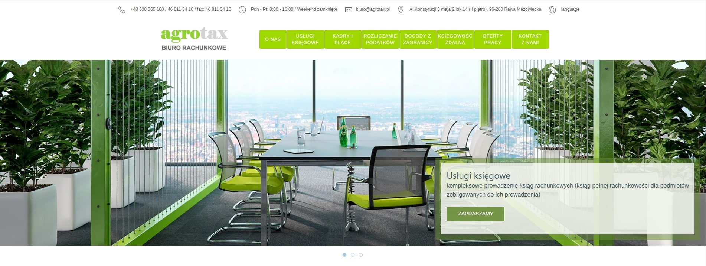

# strona biura rachunkowego AgroTax

## użyte technologie.

1. html,css,js,php
2. program tworzący pakiety [parcel.js](https://parceljs.org/)

3. platforma front-end do tworzenia szybkich i wydajnych interfejsów internetowych [uikit](https://getuikit.com/)

## niezbędne oprogramowanie.

1. środowisko wykonawcze [node.js](https://nodejs.org/en/)
2. IDE (zintegrowane środowisko programistyczne) np: [Visual Studio Code](https://code.visualstudio.com/)

## knfiguracja projektu.

1. pobranie paczkę z projektem [github](https://github.com/pablop76/agrotax)
2. wypakować
3. otworzyc folder za pomoca IDE
4. otworzyć terminal w katalogu projektu
5. zainstalowac zależności za pomocą komendy:

- npm install

## praca z projektem

1. uruchomienie

- npm start

Strona nie jest odswieżana gdy wprowadzamy zmiany w komponentach html (katalog components), można skopiować komponent html do pliku w którym jest wyswietlany, wprowadzić zmiany i po zakończonym procesie przekopiować go spowrotem.

Należy ponowniw uruchomić: npm start!

### Jezeli nie widać zmian należy usunąć folder .cache oraz folder dist!!!

2. budowanie paczki produkcyjnej

- npm run build (paczka tworzona jest w katalogu docs)
